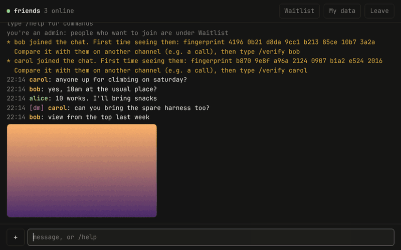
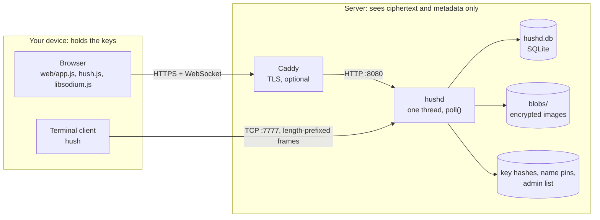
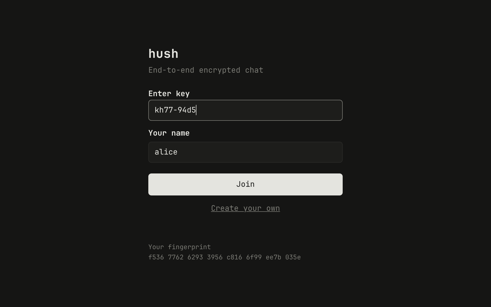
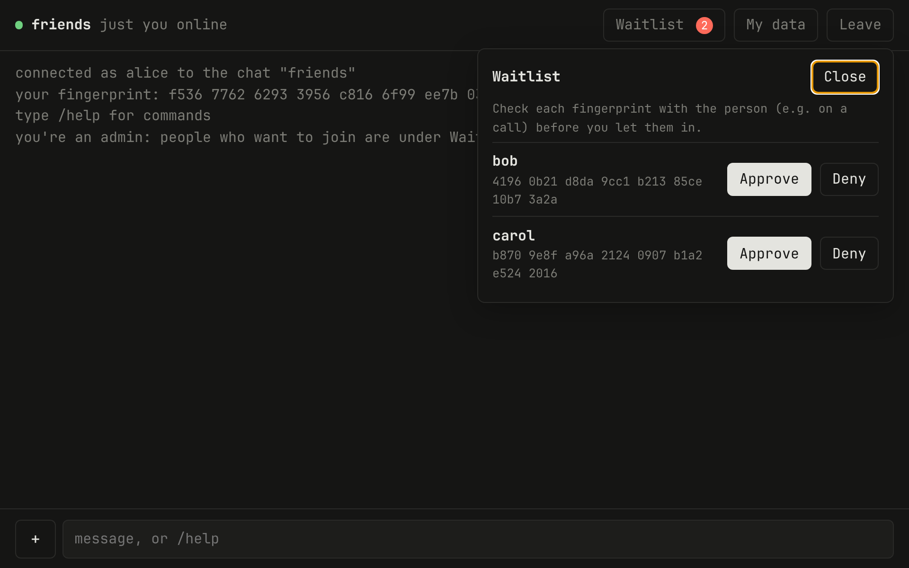
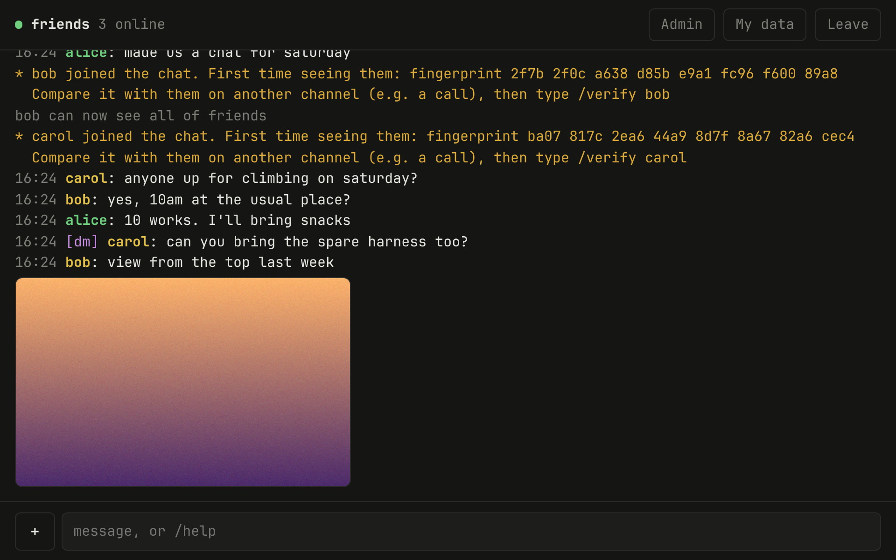
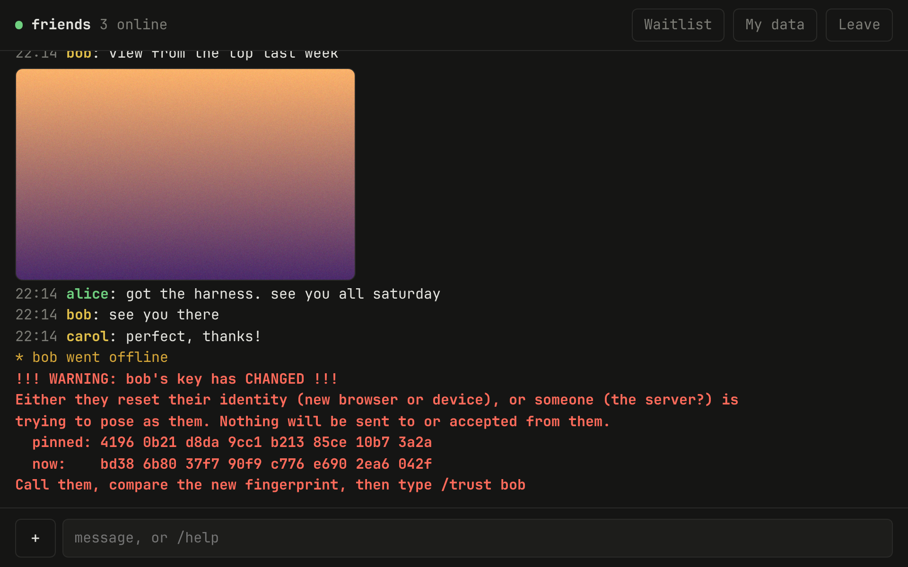

# hush

End-to-end encrypted group chat for you and your friends, in C. Chat in the browser or in the terminal,
with history, private messages and images. New people wait on a waitlist until you let them in.



- `hushd` is the server. It serves the web page and stores and passes on encrypted messages and
  images, which it cannot read. Only the person running it, and the admins they pick, can create the keys
  that let people into a chat.
- The web page (`web/`) and the terminal client (`hush`) hold your keys and do the encryption.
  Both talk the same protocol, so browser and terminal users can chat together.



| Choice | Reason |
|---|---|
| C, no framework | hushd is one binary that needs only libsodium and SQLite. The HTTP and WebSocket code is about 400 lines (`src/web.c`), small enough to read and fuzz in full. |
| libsodium | Every primitive hush uses (XChaCha20-Poly1305, `crypto_box`, Ed25519, Argon2id, BLAKE2b) comes from one library. The browser runs the same library compiled to WebAssembly. |
| SQLite | History, chat membership and the image index live in one file next to the server. No database server to run. |
| WebSockets | Browsers can't open a raw TCP socket, so the page sends the same frames over a WebSocket, one frame per message. Terminal clients use plain TCP with a length prefix. |
| One thread, `poll()` | No locks to get wrong. One process serves up to 512 connections. |

More detail in `docs/`: the [protocol](docs/PROTOCOL.md), the [cryptography](docs/CRYPTOGRAPHY.md),
the [threat model](docs/THREAT_MODEL.md), [how it's tested](docs/TESTING.md), the
[benchmark](docs/BENCHMARK.md) and [deployment](docs/DEPLOYMENT.md).

## Build

Needs a C compiler, [libsodium](https://libsodium.org) and SQLite:

```sh
sudo apt install build-essential pkg-config libsodium-dev libsqlite3-dev        # Ubuntu/Debian
sudo dnf install gcc make pkgconf libsodium-devel sqlite-devel                   # Oracle Linux/Fedora (EPEL for libsodium)
sudo pacman -S base-devel libsodium sqlite                                       # Arch

make
```

Tested on Arch Linux with gcc 16, and clang 22 builds it without warnings too. Linux only:
hushd uses `accept4` and `/proc/self/exe`.

## Testing

```sh
make test          # build, run the unit tests, then test.sh
make asan test     # the same under AddressSanitizer and UBSan
make analyze       # clang-tidy and gcc -fanalyzer, any finding fails
make fuzz          # each libFuzzer target for 60 seconds (FUZZ_TIME=600 for longer)
make coverage      # line coverage of both suites
make bench         # a real hushd under load, see docs/BENCHMARK.md
make debug         # -O0 -g3 build for gdb
```

`tests/unit.c` checks the parts that need no network: framing, names, chat key derivation (against
vectors from the browser code, so both clients stay in step), message encryption and signatures
with every kind of tampering, and the HTTP and WebSocket parsers. `test.sh` runs everything on localhost against a real hushd: scripted terminal clients, the web
client's protocol code under Node, and the HTTP side with curl. It covers wrong and old keys, the
waitlist, history and offline DMs, images and metadata stripping, data exports, name takeover,
changed keys, `clear` and `revoke`, rate limits and the reverse-proxy mode. It also checks that
the server enforces permissions itself, throws broken and random frames at it, and kills it in the
middle of an upload. It needs `python3` and `curl`, plus `node` for the web tests, and takes about
two minutes. [docs/TESTING.md](docs/TESTING.md) has the details.

## Quick start

```sh
./hushd newkey friends     # prints a key for a chat called "friends"
./hushd                    # web page on port 8080, terminal clients on port 7777
```

Open `http://SERVER-IP:8080`. The login page shows your fingerprint. Make yourself admin with it,
then enter the key and a name:

```sh
./hushd admin "6937 b1d5 6e73 e529 69b1 ba58 820e f284"     # your fingerprint from the login page
```



Give the key to your friends. When they join, they wait until you approve them in the chat.

### With Docker

```sh
docker compose up -d --build
docker compose exec hushd /opt/hush/bin/hushd -C /data newkey friends
docker compose exec hushd /opt/hush/bin/hushd -C /data admin "YOUR FINGERPRINT"
```

Then open `http://localhost:8080`. Everything hushd keeps is in the `hush-data` volume, and
`docker compose stop` shuts it down cleanly. Connections from the machine running Docker all
arrive from the bridge's address, so they share one set of rate limits. For a server people
actually use, follow [docs/DEPLOYMENT.md](docs/DEPLOYMENT.md) instead: behind Caddy on the same
machine, hushd sees each visitor's real address.

## Deploying

For a VPS with HTTPS, a firewall and a locked-down systemd service, see
[docs/DEPLOYMENT.md](docs/DEPLOYMENT.md). It also covers upgrading from the version without history.

## Managing chats

Each key opens one chat, and looks like `k3x7-9fqa`. Admins create chats on the home page:
**+ Add session**, then **Create your own** (or `/newchat NAME` in the terminal). The key is made on
their device. The server only gets a login token derived from it, and stores just a hash of that.
On the server:

```sh
hushd newkey NAME     # new chat; prints its key once (the server keeps only a hash)
hushd keys            # list chats, with how many messages and images each one stores
hushd clear NAME      # delete a chat's messages and images; the key keeps working
hushd revoke NAME     # delete a chat: its key, messages and images; everyone in it is disconnected
hushd forget USER     # free up a name, e.g. when a friend lost their browser data
hushd backup DIR      # copy everything into a new DIR, safe while hushd runs
```

A running server picks up these changes by itself. Add `-C DIR` to work on the files in DIR.
For the VPS setup in [docs/DEPLOYMENT.md](docs/DEPLOYMENT.md) that's `sudo -u hush hushd -C /var/lib/hush ...`.

### Admins and the waitlist

Admins are identity keys, not names, so nobody becomes admin by picking your name. Everyone's
fingerprint is on their login page, and in `/fp`.

```sh
hushd admin "FINGERPRINT"     # that key is admin in every chat, and never waits
hushd unadmin "FINGERPRINT"
hushd admins                  # list them
```

The first time someone joins a chat, they land on a waiting screen and see nothing of the chat.
Admins in the chat get a request with the person's name and fingerprint, and **Approve** / **Deny**
buttons (in the terminal: `/approve NAME`, `/deny NAME`, `/waiting`). Check the fingerprint with them
before approving, e.g. over a call. Denied people can't try again. Without being online:

```sh
hushd pending                 # who's waiting for which chat
hushd approve CHAT NAME       # they get in within a second if they're waiting right now
hushd deny CHAT NAME
```



### Getting the data out

- Anyone can use the **My data** button to download a zip of everything they sent in the chat and
  every DM sent to them, with their images, decrypted in the browser. In the terminal, `/mydata`
  saves the same to a folder in `~/Downloads`.
- The operator can run `hushd export CHAT DIR`. It asks for the chat's key and decrypts the whole
  chat into `DIR`: `messages.txt` (readable), `messages.json` (with signature checks) and `images/`.
  DMs can't be opened with the chat key, so they're listed without their contents. The folder is the
  chat in plain form: copy it off the server and delete it there.

Messages and images are kept until you `clear` or `revoke` the chat. Uploads are refused
while the disk has less than 1 GB free.

The first time someone joins with a name, the server ties that name to their identity key,
so nobody else can use it. A new browser or device has a new key, so it needs a new name
(or `hushd forget` the old one).

## Terminal client

```sh
./hush -n yourname HOST                 # asks for the chat key
./hush -n yourname -k KEY HOST:PORT     # or HOST PORT; [ipv6]:PORT; the key can also go in $HUSH_KEY
```

Prefer the prompt or `$HUSH_KEY` over `-k`, since other users on your machine can see command lines.
Your identity key is created on first run in `~/.local/share/hush/identity.key`.
Back it up. If you lose it, your friends will get a "key changed" warning.

```text
$ ./hush -n carol 127.0.0.1
chat key:
You're on the waitlist for "friends": an admin has to let you in.
They'll see your fingerprint, b870 9e8f a96a 2124 0907 b1a2 e524 2016, so they can check it's you.
Waiting... (Ctrl-C to give up)
connected to 127.0.0.1:7777 as carol, chat: friends
your fingerprint: b870 9e8f a96a 2124 0907 b1a2 e524 2016
type /help for commands
* alice is online. First time seeing them: fingerprint f536 7762 6293 3956 c816 6f99 ee7b 035e
  Compare it with them on another channel (e.g. a call), then run /verify alice
22:14 carol: anyone up for climbing on saturday?
22:14 bob: yes, 10am at the usual place?
22:14 alice: 10 works. I'll bring snacks
22:14 [dm to alice] carol: can you bring the spare harness too?
22:14 bob: [image 1600x1000, 1.2 MB, /save 5] view from the top last week
```

## Commands

| | |
|---|---|
| `text` + Enter | send to everyone in the chat |
| `/msg NAME TEXT` | private message; they get it even if they're offline |
| `/who` | who's in the chat, with fingerprints and trust state |
| `/fp [NAME]` | your fingerprint, or someone else's |
| `/verify NAME` | mark NAME as verified after comparing fingerprints |
| `/trust NAME` | accept NAME's new key after it changed |
| `/quit` | leave (also the Leave button, or Ctrl-C in the terminal) |
| `/waiting`, `/approve NAME`, `/deny NAME` | admins: the waitlist |
| `/newchat NAME` | admins: create a chat and get its key (in the page: + Add session, Create your own) |

In the browser, chats you've joined are saved on the login page: click one to rejoin, or
**+ Add session** to join another with its key. Send an image with the **+** button or by pasting
it; whatever is typed in the box goes along as its caption. Click an image to see it full size and
save it. **Load older messages** at the top goes back in time.



In the terminal: `/img FILE [caption]` sends an image (jpeg, png, gif or webp, up to 25 MB),
`/save N` saves image N to `~/Downloads`, `/more` shows older messages, and `/mydata` saves your data.

Verify your friends once. On a call (or in person), each of you reads out
the fingerprint from `/fp`, checks it against what `/fp THEIRNAME` shows, and then runs
`/verify THEIRNAME`. After that, the server can't swap in its own key to read your DMs
or pose as your friends without you getting a loud warning.



## How it works

- Your client turns the chat key into two unrelated values: a login token, which is all the server
  ever sees (it stores only a hash of it), and the chat's encryption key, which never leaves the clients.
- Each user has an Ed25519 identity keypair: in `identity.key` for the terminal client, and in the
  browser's local storage for the web page. It never leaves your device. To log in, you sign a random
  challenge from the server, and the server ties each name to the first identity key that registers it.
- Chat messages are encrypted with the chat's key (XChaCha20-Poly1305), so everyone in the chat,
  including people who join later, can read its history. DMs are encrypted for just the two people
  involved with `crypto_box` (X25519, XSalsa20-Poly1305).
- Every message is signed by its sender's identity key. The signature covers the chat, the sender, the
  recipient, the time and a random ID, so nobody (members or server) can forge, relabel, move or
  replay a message without it being rejected.
- Images get their own random key. The encrypted image is uploaded, and the message carries the key.
  Before sending, the browser redraws photos (and the terminal client strips their metadata blocks),
  which removes hidden data like the GPS position phones store in them.
- The server keeps messages in SQLite and images as files, all encrypted. It knows who sent what to
  which chat or person, and when, but not what it says.
- The waitlist is enforced by the server: it sends people nothing from a chat until they're approved.
- Key pinning (TOFU): your client remembers every friend's key. If the server ever hands you a
  different key for them, the client warns you loudly and refuses to show their messages or send
  them DMs until you `/trust` it.
- Browsers speak the same protocol over a WebSocket. The page uses
  [libsodium.js](https://github.com/jedisct1/libsodium.js), served by hushd itself (see `web/LIBSODIUM.txt`).

## Server hardening

- A chat key is 40 random bits, stretched with Argon2id (128 MB, 3 passes) before anything is derived
  from it, so every guess costs real time and memory. The server stores only a hash of the login token,
  in a `0600` file. Guessing keys by logging in is capped by the rate limits below.
- Rate limits per IP address (per /64 for IPv6): new connections and page requests (burst of 30,
  then one every 2 seconds), open connections (16), wrong chat keys (5, then one a minute) and
  uploaded bytes (100 MB, then 1 MB a second), plus messages and requests per connection.
  Over the limit, requests get `429` and logins get refused.
- Connections that don't finish their request within 10 seconds, or their login within 15, are dropped.
- The HTTP parser is strict and small: GET/HEAD only, 8 KB of headers, no control characters, no line folding,
  no duplicate `Host`. Only a fixed list of files is served, so request paths never touch the filesystem;
  images only travel over the logged-in connection, and only to people in the same chat.
- Every database query is a prepared statement with bound parameters, so nothing a client sends can
  change a query (no SQL injection). Names and chat labels are limited to `A-Z a-z 0-9 _ . -`, and all
  incoming text is shown as plain text, never parsed as HTML.
- Every page is sent with a strict Content-Security-Policy (only its own scripts, no inline code,
  images only from decrypted data, can only connect back to this server, can't be framed),
  plus `nosniff`, `no-referrer` and friends. Only jpeg, png, gif and webp images are shown.
- WebSocket connections from other websites are refused by checking the `Origin` header.
- `contrib/hushd.service` runs hushd as its own user, with no capabilities and a read-only view of
  the system apart from `/var/lib/hush`.
- `make test` covers the above, and `make asan test` runs all of it under AddressSanitizer and UBSan.
  The HTTP, WebSocket, frame and message parsers have libFuzzer targets in `fuzz/`.

## Limitations (read these)

This is a hobby project and hasn't had a professional security audit.

- **The web page comes from the server.** If someone takes over your server, they can change the page to
  leak messages from browser users. That's true of any web-based encrypted chat. The terminal client
  doesn't have this problem, and fingerprint checks still catch key swaps.
- Use HTTPS. Over plain HTTP, anyone on the network path could change the page on its way to your friends.
- Chat keys are short so they're easy to share. Guessing one by logging in would take years at the
  rate limits, but someone who steals the server's files can try keys offline; Argon2id makes that
  cost thousands of CPU-years per chat, not seconds. Keys made before keys got shorter (24 characters)
  are much stronger and keep working.
- **Anyone with a chat key can read that chat's whole history**, including what was said before they
  joined. If a key leaks, `hushd revoke` it (which deletes the history) and make a new one.
- The waitlist keeps people out of the server, not out of the encryption: someone who has the chat key
  and also gets a copy of the server's files could read the chat without ever being approved.
- History is kept forever unless you `clear` it, and there's no forward secrecy: whoever gets both a copy
  of the server's files and the chat key (or, for DMs, one side's identity key) can read everything stored.
- Members can post junk the server can't tell apart from real messages, since it can't read them.
  Everyone else's client drops it with a warning.
- The server sees metadata: who is in which chat, who messages whom, when, how long each message is,
  and how big each image is. The terminal client's connection isn't wrapped in TLS, so anyone on the
  network path sees that metadata too.
- Identity keys, and in the browser the keys of saved chats, are stored unencrypted (file permission 0600,
  or the browser's storage). Anyone with access to your account or browser profile can take them.
  A new browser or device is a new identity.
- A malicious server can drop, hide or reorder messages. It can't read or forge them without you
  noticing a key change.

## License

MIT, see [LICENSE](LICENSE).
